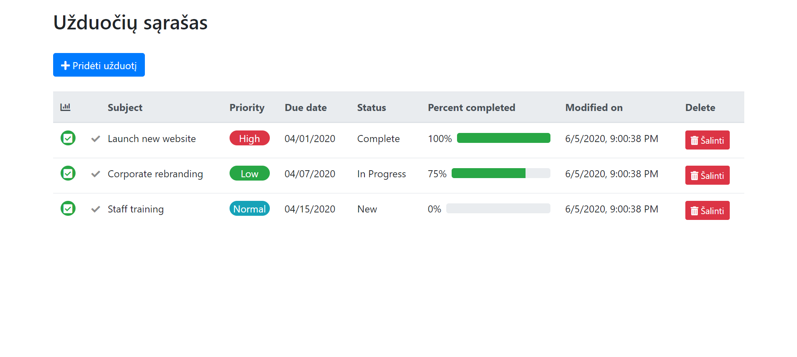
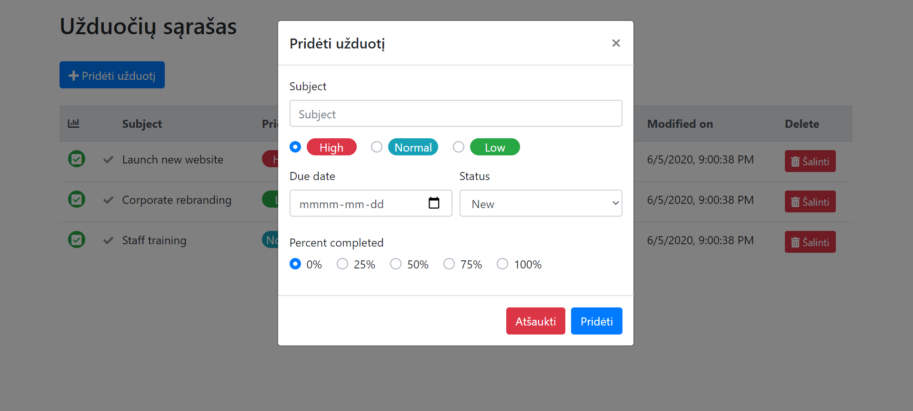

# To Do app
A simple to do app created with JS and Bootstrap.

## General info
This is a training project to learn JavaScript.
The [task](js_todo.pdf) was to create a simple to do app with these functionalities:
* add new task to the list
* delete task
* mark task as done

## Technologies
Project is created with:
* Bootstrap v4.4.1
* JavaScript (ES6)

## Illustrations
Example view of the tasks list

Add new task view

